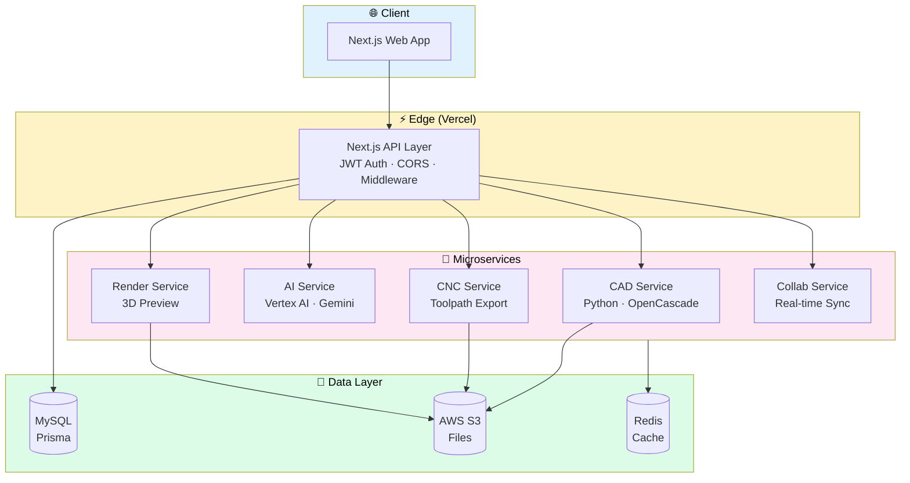

# 🪚 CabinetFlow AI

### **From Sketch to CNC — in Minutes, Not Days.**

**The AI-powered cloud CAD/CAM platform built for cabinet shops.**

[Live Demo](https://www.cabinetflowai.com) · [Request Access](https://www.cabinetflowai.com) · [Contact Sales](https://www.cabinetflowai.com)

---

## 🎯 The Problem

Cabinet shops still lose hours every day moving between:

> 📝 Client sketches → 📐 CAD software → 📊 Cutlist spreadsheets → 🔨 CNC machines → 📞 Installer calls

Each handoff is manual. Each error is expensive. Each project is slower than it should be.

**We fix that.**

---

## ✨ The Solution

CabinetFlow AI collapses the entire cabinet design-to-production workflow into a single, browser-based platform — no downloads, no CAD licenses, no learning curve.

*The CabinetFlow AI dashboard — projects, revisions, and production runs at a glance.*

---

## 🚀 Core Features

<table>
<tr>
<td width="50%" valign="top">

### 🖼️ Sketch-to-CAD
Snap a photo of a hand-drawn sketch. Get a fully parametric 3D cabinet in seconds.

</td>
<td width="50%" valign="top">

### 🧠 AI Design Validation
Gemini-powered checks catch structural, clearance, and code issues **before** production.

</td>
</tr>
<tr>
<td width="50%" valign="top">

### 📐 Parametric 3D Modeling
Change one dimension, everything updates. Powered by OpenCascade — the same engine used in industrial CAD.

</td>
<td width="50%" valign="top">

### 📊 Automated Cutlist & Nesting
Optimized panel layouts. Less waste. Better margins.

</td>
</tr>
<tr>
<td width="50%" valign="top">

### 🔧 One-Click CNC Export
Direct output to your machines. No manual toolpath work.

</td>
<td width="50%" valign="top">

### 🤝 Real-Time Collaboration
Designers, installers, and clients all on the same page.

</td>
</tr>
</table>

---

## 🔄 How It Works

```mermaid
flowchart LR
    A[📝 Client Sketch] --> B[🧠 Sketch-to-CAD AI]
    B --> C[📐 Parametric 3D Cabinet]
    C --> D[✅ AI Validation]
    D --> E[📊 Cutlist & Nesting]
    E --> F[🔧 CNC Export]
    F --> G[🏭 Production]
    G --> H[📱 Installer App]

    style A fill:#e0f2fe,stroke:#0284c7,color:#000
    style B fill:#fce7f3,stroke:#db2777,color:#000
    style D fill:#fce7f3,stroke:#db2777,color:#000
    style G fill:#dcfce7,stroke:#16a34a,color:#000
    style H fill:#dcfce7,stroke:#16a34a,color:#000
```

**From a napkin sketch to a machine-ready cut file — without switching apps once.**

---

## 🏗️ Architecture

A modern, cloud-native platform built to scale.

---

## 💡 Who It's For

<table>
<tr>
<td align="center" width="33%">

### 🏭 **Cabinet Shops**
Cut design time by 80%.
More jobs. Fewer errors.
Better margins.

</td>
<td align="center" width="33%">

### 👷 **Installers**
Real-time job details.
Feedback loop to the shop.
Fewer callbacks.

</td>
<td align="center" width="33%">

### 🎨 **Designers**
No CAD license required.
Client-friendly previews.
Instant revisions.

</td>
</tr>
</table>

---

## 📸 Screenshots

### Parametric 3D Cabinet Designer

### Automated Nesting & Cutlist

### AI Design Validation

### Sketch-to-CAD

---

## 🛠️ Tech Stack

| Layer | Technology |
|---|---|
| **Frontend** | Next.js · React · TypeScript · Tailwind CSS · Three.js |
| **API** | Next.js API Routes · JWT (jose) · Prisma |
| **CAD Engine** | Python · FastAPI · OpenCascade (pythonocc-core) |
| **AI** | Google Vertex AI · Gemini 1.5 Pro · LangChain |
| **Database** | MySQL · Prisma ORM |
| **Storage** | AWS S3 |
| **Cache** | Redis |
| **Deploy** | Vercel · Docker · Hostinger VPS · GCP Vertex AI |
| **Monorepo** | Turborepo |

---

## 📈 Roadmap

- [x] Parametric cabinet designer
- [x] AI-powered validation
- [x] Automated cutlist & nesting
- [x] CNC export
- [x] Real-time collaboration
- [x] Sketch-to-CAD
- [ ] Installer mobile app
- [ ] Vendor marketplace
- [ ] Multi-language support
- [ ] Machine learning cost optimization

---

## 📞 Get in Touch

Ready to modernize your shop?

- 🌐 **Website:** [cabinetflowai.com](https://www.cabinetflowai.com)
- 📧 **Email:** hello@cabinetflowai.com
- 📞 **Voice Assistant (Mia):** (267) 861-9083

---

**Built with care for the shops that build with care.** 🪚

*© 2026 CabinetFlow AI. All rights reserved.*

